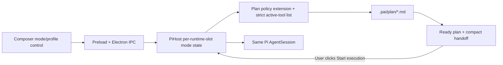

# Plan / Execute Mode — Implementation Plan

**Status:** implemented (MVP)
**Date:** 2026-08-12
**Owner:** Pi Desk  
**Scope:** one Pi Desk session can move between a high-reasoning, non-mutating planning phase and a normal execution phase without losing its conversation.

## Decision

Add a per-session workflow mode with two independently configurable profiles:

| Mode | Model and thinking | Agent capability | Result |
|---|---|---|---|
| `plan` | User-selected model and supported reasoning level | Read/search only; a dedicated plan-artifact tool may write **only** under `<project>/.pai/plan/` | A versioned Markdown implementation plan and a concise execution handoff |
| `execute` | User-selected execution model and supported reasoning level | Existing full tool set | Code, tests, and other requested work |

Mode belongs to the Pi Desk session, not to the project or global app settings. The underlying Pi JSONL session remains the one source of conversational history; the mode metadata is stored by Pi Desk, keyed by the session’s stable session file/ID, so resume, focus, and multi-session operation restore the correct profile.

**Do not silently change modes solely because an LLM says a plan is complete.** When a plan is saved with `ready` status, surface a clear **Start execution** action. Automatic transition may be offered later as an opt-in setting, but only after a valid saved plan and a structured ready signal.

## Implementation status

The MVP is implemented in the current workspace:

- Per-session Plan/Execute mode and independent model/thinking profiles.
- Strict Plan tool allowlist plus extension-level `tool_call` blocking.
- Atomic, revisioned Markdown plans under `.pai/plan/` with path/symlink safety.
- Plan editor occupying the upper conversation canvas; bottom composer remains unchanged.
- Explicit `Mark ready` and `Start execution` handoff into the same session.
- IPC, renderer state/events, multi-session `sessionKey` routing, focused tests, typecheck, and production build.

Deferred enhancements are interactive conflict resolution, Markdown preview/code-reference links, plan history UI, and opt-in automatic transition.

## Product contract

### Plan mode

1. The agent may inspect the workspace and discuss alternatives indefinitely.
2. It must not modify project files, run shell commands, invoke mutating MCP/custom tools, or execute extension commands that can mutate state.
3. The one allowed write is `save_plan`, a Pi Desk-owned tool that validates the relative output path and writes Markdown only below `.pai/plan/`.
4. Each saved plan has front matter describing lifecycle state and a stable plan ID. Re-saving updates the active artifact intentionally; **Save as new** creates another artifact.
5. The composer shows `Plan`, the active planning profile, and the planning-specific placeholder: “Explore and design; project changes are locked.”

### Execute mode

1. Existing behavior remains unchanged: all currently registered tools and extension tools are available.
2. On transition, Pi Desk first selects the execute profile, enables the normal tool set, then sends a synthetic user-visible handoff message containing the active plan path and its compact handoff section.
3. If no active ready plan exists (because the user manually switched), execute is still allowed; the handoff states that no saved plan is attached.
4. The composer shows `Execute` and the execution profile.

### Profiles and availability

- A profile is `{ modelKey, thinkingLevel }`, where `modelKey` is `provider/id`.
- The profile picker uses the existing authenticated and intentionally-enabled model list. It must never imply that every advertised reasoning level works for every provider.
- Changing a mode’s picker updates that mode’s stored profile. When that mode is active, call Pi’s existing `setModel()` and `setThinkingLevel()` immediately; when inactive, only save the profile.
- New sessions default to `execute`; its initial profile is the session’s existing selected model/thinking level. The Plan profile initially clones Execute, then may be changed independently.
- A missing/deauthenticated model does not block resume: preserve the stored value, show it as unavailable, and use the current Pi model until the user selects an available replacement.

### Plan artifact schema

Directory: `<workspace>/.pai/plan/` (singular, per product decision).

Filename: `YYYY-MM-DD-HHmm-<slug>.md`; `slug` is restricted to lowercase ASCII letters, digits, and hyphens. Writes must resolve under the canonical plan directory after `realpath`/path normalization; absolute paths, `..`, symlink escapes, and non-Markdown extensions are rejected.

```md
---
id: plan_01J...
status: draft # draft | ready | executing | superseded | completed
createdAt: 2026-08-11T12:00:00.000Z
updatedAt: 2026-08-11T12:04:00.000Z
sourceSession: <Pi session ID>
planningProfile:
  model: provider/model
  thinkingLevel: high
---

# <Human-readable title>

## Goal
## Current understanding
## Decisions and trade-offs
## Implementation steps
## Verification
## Risks / open questions
## Execution handoff
```

Plan files are normal project artifacts. Do **not** add `.pai/` to `.gitignore` automatically; teams decide whether to commit plans. The UI should expose “Reveal plan” and “Copy path,” not silently stage or commit it.

## Architecture



The active-tool list is the normal first barrier. A Pi extension `tool_call` guard is a second, authoritative barrier that blocks anything outside the plan allowlist should a stale or newly registered tool become reachable. This matters because the present runtime explicitly enables every built-in and extension tool in `createSdkRuntime()`.

The mode guard must not rely on an LLM system prompt. It should add a planning instruction for clarity, but enforcement is in code.

## Data and API design

### Shared protocol — `src/shared/protocol.ts`

Add:

```ts
export type AgentMode = "plan" | "execute";
export type PlanStatus = "draft" | "ready" | "executing" | "superseded" | "completed";

export interface AgentProfile {
  modelKey?: string;
  thinkingLevel: ThinkingLevel;
}

export interface PlanArtifactSummary {
  id: string;
  path: string;               // absolute path only across IPC
  title: string;
  status: PlanStatus;
  updatedAt: string;
}

export interface SessionModeState {
  mode: AgentMode;
  planProfile: AgentProfile;
  executeProfile: AgentProfile;
  activePlan?: PlanArtifactSummary;
}
```

Include `modeState: SessionModeState` in `SessionState` and `SessionSummary`. Add `mode_changed` and `plan_artifact_changed` Pi events. Add these `PiApi` methods, all accepting existing `SessionCommandOptions` so a background live session cannot accidentally change the focused session:

```ts
setMode(mode: AgentMode, opts?: SessionCommandOptions): Promise<SessionModeState>;
setModeProfile(mode: AgentMode, profile: AgentProfile, opts?: SessionCommandOptions): Promise<SessionModeState>;
listPlans(opts?: SessionCommandOptions): Promise<PlanArtifactSummary[]>;
readPlan(planId: string, opts?: SessionCommandOptions): Promise<{ summary: PlanArtifactSummary; content: string }>;
updatePlan(planId: string, content: string, opts?: SessionCommandOptions): Promise<PlanArtifactSummary>;
startExecution(planId?: string, opts?: SessionCommandOptions): Promise<SessionModeState>;
```

Do not overload `setModel`/`setThinkingLevel`: those APIs preserve their current immediate-session semantics. The new profile API owns per-mode persistence and applies changes when relevant.

### Host-owned persistence — new `electron/planMode.ts`

Create pure types/helpers plus a small workspace metadata store at `.pai/session-modes.json`:

```json
{
  "version": 1,
  "sessions": {
    "file:/absolute/session.jsonl": {
      "mode": "plan",
      "planProfile": { "modelKey": "anthropic/claude-opus-4-5", "thinkingLevel": "high" },
      "executeProfile": { "modelKey": "openai/gpt-5", "thinkingLevel": "medium" },
      "activePlanId": "plan_..."
    }
  }
}
```

- Key live slots by `sessionFile` where present; use `id:<sessionId>` until first persistence, then migrate the ephemeral key to the session-file key.
- Reads tolerate a missing/corrupt store: emit a non-fatal notification, preserve the current session, and recreate a valid store on the next intentional update.
- Atomic writes use a temp file in `.pai/` followed by `rename`; never leave partially written JSON.
- Keep `PlanArtifact` parsing and path validation in this module so Electron main is the only code able to write artifacts.

### Runtime slot changes — `electron/piHost.ts`

Extend `RuntimeSlot` with `modeState` and its policy/guard handle. On slot binding/rebinding:

1. Load/create the session’s stored `SessionModeState` using the current actual Pi model/level as defaults.
2. Register the plan extension factory for every runtime. It receives a callback that reads the slot’s live mode state, and a safe callback for artifact operations; it does not decide mode itself.
3. Apply the mode’s profile and allowed tools before accepting the next prompt.
4. Emit `mode_changed` during the initial `session_started` sequence and include it in `snapshot()`.

Use named policy sets, not ad-hoc filtering:

```ts
const EXECUTE_TOOLS = () => session.getAllTools().map((tool) => tool.name);
const PLAN_TOOLS = ["read", "grep", "find", "ls", "plan_save", "plan_list", "plan_read"];
```

`bash`, `write`, `edit`, HTTP workbench write/run tools, todo writes, MCP tools, and all unknown future extension tools are excluded from `PLAN_TOOLS` by default. The extension guard must block them by name even if an active-tool update arrives late. The Plan artifact custom tools validate all inputs independently; only `plan_save` performs a write.

`setMode("plan")` rejects while that slot is streaming (the renderer disables it), applies the stored Plan profile followed by `PLAN_TOOLS`, persists, and emits state. `setMode("execute")` does the symmetric operation. Always apply the model before the next turn, then `setThinkingLevel`, then tool policy.

`startExecution(planId?)` must:

1. reject during streaming;
2. find and validate the requested/active artifact;
3. set its front matter status to `executing` (this is a permitted host-side lifecycle update);
4. switch to Execute and persist/emit it;
5. call the normal `prompt()` path with a deterministic handoff message referencing the plan file and embedding only its `## Execution handoff` content (bounded to 6,000 characters);
6. leave the user in execute mode even if Pi rejects the handoff prompt, while surfacing the error and allowing resend.

For a manual mode switch, do not mutate plan status or send a synthetic prompt.

### Plan extension — new `electron/planModeExtension.ts`

Register the three tools and the guard through `ExtensionAPI`:

- `plan_save({ title, content, status?, planId? })`: validates schema and path via host callback, returns absolute plan path and summary.
- `plan_list()`: returns summaries from `.pai/plan/`.
- `plan_read({ planId })`: returns validated plan content, capped to the model tool-output budget.
- `pi.on("tool_call", ...)`: returns `{ block: true, reason: "Plan mode permits read/search and .pai/plan artifacts only." }` for every tool except the three named plan tools and the built-in read/search tools while mode is `plan`.
- `pi.on("before_agent_start", ...)`: adds concise mode instructions; it must not be used as the enforcement mechanism.

The existing `extensionFactories` list in `createSdkRuntime()` gains this extension next to `session-todo`, MCP, and HTTP workbench. Do not use a global mutable `this.mode`: each factory must close over the current runtime slot/session identity so concurrent live sessions cannot leak policy into each other.

### IPC — `electron/main.ts` and `electron/preload.ts`

Expose a handler and preload bridge for each new `PiApi` method. Validate only normal serializable data at the IPC boundary; all path and lifecycle validation remains in `PiHost`/`planMode.ts`. Return a fresh snapshot/state after mutations so render state cannot depend on event timing.

## UI design

### Composer controls

Create `src/renderer/components/ModeSwitcher.tsx` and mount it in the existing composer toolbar before model selection. It is a compact two-option segmented control:

- `Plan` uses a compass/list icon and an amber-violet mode treatment.
- `Execute` uses the existing run/play icon and the normal accent treatment.
- Both controls have `aria-pressed`; tooltip states `Plan — project changes locked` / `Execute — tools can modify the project`.
- While streaming, both are disabled and say “Stop the current turn before changing mode.”

When mode changes, `Composer` receives **the active mode profile** for its existing `ModelSelector` and thinking menu. Its callbacks call `setModeProfile(activeMode, ...)`, not raw `setModel` / `setThinkingLevel`. This keeps the existing selector UI while making profiles independent.

Below the Plan selector, show a small status chip:

- `No saved plan` → `Save plan` is agent-driven only; show explanatory tooltip.
- `Draft: <title>` → click opens/reveals plan.
- `Ready: <title>` → primary `Start execution` action.
- `Executing: <title>` → link/reveal action, no duplicate transition.

Do not make the renderer write Markdown directly. “Reveal” calls existing `revealInFolder`; adding an optional `openPlan` API can be deferred.

### Plan workspace — occupy the current conversation canvas

Plan mode must make the plan a first-class, reviewable document, not merely a chat message or a hidden file. Follow Cursor’s useful pattern—agent research, clarification, an editable Markdown plan, then explicit build approval—but retain Pi Desk’s separate profile and permission policy. Cursor’s implementation specifically gives the model plan tools and an inline plan editor, lets the user review/edit the plan, and starts building only when the user is ready. [Cursor Plan Mode](https://cursor.com/blog/plan-mode)

**Do not add a right-hand Plan inspector.** When the active session is in Plan mode, the upper, current conversation/timeline canvas becomes the Plan workspace. The bottom composer remains exactly where it is: users continue their conversation, answer questions, select their planning model, and send messages without switching visual regions.

```
┌──────────────────── current chat canvas ────────────────────┐
│  Plan: Add Plan / Execute Mode          Draft · updated now  │
│  <editable Markdown plan>                                    │
│  Goal / code references / steps / verification / questions   │
│                                                              │
│  [Save] [Mark ready]                    [Start execution]   │
├──────────────────── existing composer, unchanged ───────────┤
│  [Plan] [planning model] [effort]  Discuss or refine plan…  │
└──────────────────────────────────────────────────────────────┘
```

The ordinary message timeline is not destroyed. It remains session history and is accessible through a small `Conversation` control in the Plan header (or by leaving Plan mode); the active default during planning is always the document. This prevents the plan from being buried by a long research conversation while retaining every message for later execution context.

Behavior:

1. On first entry to Plan, show an empty, guided document with the standard headings and one primary action: **Ask agent to draft plan**. Do not create an empty file until either the user or model saves it.
2. When the model calls `plan_save`, automatically select that artifact in the Plan tab and show its current Markdown. The user can switch among prior plans from a compact plan list at the top.
3. The document is directly editable by the user. `Cmd/Ctrl+S`, blur, and the Save button call `updatePlan`; this is an intentional user-authorized plan-artifact write, still constrained to `.pai/plan/`.
4. While editor text is dirty, show `Unsaved changes`; disable **Start execution** until saved. If the agent has changed the artifact since editor load, show a three-way choice: **Reload agent version**, **Overwrite with mine**, or **Copy mine**. Do not silently overwrite either party.
5. The footer shows `Draft` / `Ready` / `Executing`, file path, last update, and clear actions: **Mark ready**, **Save as new**, **Reveal**, and **Start execution**. `Start execution` is prominent only for a saved Ready plan.
6. Render paths and `path:line` references as clickable code references when the referenced local file exists; clicking uses the existing open/reveal capability. Keep this a progressive enhancement, not a requirement for plan saving.
7. Keep model questions in chat—where the user can answer naturally—but summarize unresolved questions in a non-editable “Open questions” callout in the Plan tab. No modal questionnaire in v1.

The document editor should use a plain textarea/monospace Markdown editor in v1, not a full rich-text editor. It keeps the artifact portable, allows the model and user to collaborate on the same source of truth, and avoids introducing a document model. Preview rendering and line-level code-reference navigation can follow once the main lifecycle is stable.

Add to `PlanArtifactSummary` a revision value (content hash or monotonic `updatedAt` plus hash) and require that value on `updatePlan`. The host rejects stale writes with a conflict payload; this is essential because agent tool writes and user edits can overlap in the same session.

New renderer files for this surface:

- `src/renderer/components/PlanWorkspace.tsx` — replaces the timeline canvas only while planning; artifact list, status controls, editing lifecycle, conversation toggle, and conflict UI.
- `src/renderer/components/PlanWorkspace.test.tsx` — initial/draft/ready/edit/conflict/start behavior and restoration of the conversation canvas.
- `src/renderer/components/PlanMarkdown.tsx` (optional after v1) — safe Markdown preview and local code-reference links.

Extend the Phase 2 UI scope to conditionally render `PlanWorkspace` in place of the timeline and extend Phase 3 tests with user edit, stale revision, Ready confirmation, conversation toggle, and transition-to-execution coverage.

### State routing

- `appStore.ts` incorporates `mode_changed` and `plan_artifact_changed` and resets to the mode state included in every `session_started` snapshot.
- The existing multi-session view routing must store `SessionState.modeState` with each tab view; focusing another live runtime must replace the toolbar control with that session’s mode/profile.
- Session tab/sidebar summaries show a small `Plan` badge when a background session is planning. This is informational only; do not add a third status state or alter running/error semantics.
- The Settings dialog stays global for provider login and available-model configuration. It does not own the two session profiles.

### Copy and empty states

- Plan placeholder: `Explore the codebase and design a plan. Project changes are locked.`
- Execute placeholder: existing copy.
- Switching from Plan with an unsaved draft: allow it, but show non-blocking toast: `Plan mode ended without a saved ready plan.`
- Starting execution with no `ready` plan: require an explicit confirmation dialog only in the UI action; manual `Execute` toggle remains immediate.

## Delivery phases

### Phase 0 — contract and safety helpers

**Files:**

- New `electron/planMode.ts`
- New `electron/planMode.test.ts`
- Modify `src/shared/protocol.ts`
- Modify `src/renderer/state/appStore.ts`
- Modify `src/renderer/state/appStore.test.ts`

- [ ] Implement protocol types/events and pure state reducer coverage.
- [ ] Implement safe plan directory resolution, filename/slug validation, front-matter parse/serialize, plan discovery, and atomic metadata writes.
- [ ] Test traversal, symlink, absolute path, bad extension, invalid front matter, ID collision, corrupt metadata, and ready-plan parsing.

**Acceptance:** no live Pi code changes yet; helpers are deterministic and fully unit-tested.

### Phase 1 — host mode state and enforcement

**Files:**

- New `electron/planModeExtension.ts`
- New `electron/planModeExtension.test.ts`
- Modify `electron/piHost.ts`
- Modify `electron/piHost.test.ts`

- [ ] Add slot-scoped mode loading/persistence, profile application, active-tool policy, and snapshot/event emission.
- [ ] Register the mode extension in `createSdkRuntime()`.
- [ ] Add PiHost APIs: `setMode`, `setModeProfile`, `listPlans`, and `startExecution`.
- [ ] Add a host test fake that records `setModel`, `setThinkingLevel`, `setActiveToolsByName`, prompts, and mode persistence calls.

**Required tests:**

1. New session defaults to Execute and clones current Pi configuration into both profiles.
2. Plan switch sets Plan model/effort and enables exactly Plan tool names.
3. Execute switch restores execution profile and full registered tools.
4. Profile edits while inactive persist without changing Pi; edits while active apply immediately.
5. A blocked `write`, `edit`, `bash`, and arbitrary MCP tool produces an error result in Plan; `plan_save` succeeds only in `.pai/plan`.
6. Switching modes/start execution is rejected during streaming.
7. Resume/focus/fork key migration restores independent states for two live sessions.
8. `startExecution` marks the selected ready plan executing and sends exactly one bounded handoff prompt.

**Acceptance:** it is impossible for an LLM tool call to mutate the project in Plan mode, including through currently registered extensions.

### Phase 2 — IPC and composer experience

**Files:**

- Modify `electron/main.ts`
- Modify `electron/preload.ts`
- New `src/renderer/components/ModeSwitcher.tsx`
- New `src/renderer/components/ModeSwitcher.test.tsx`
- Modify `src/renderer/components/Composer.tsx`
- Modify `src/renderer/components/Composer.test.tsx`
- Modify `src/renderer/App.tsx`
- Modify `src/renderer/styles.css`
- Modify `src/renderer/app.send-flow.test.tsx`

- [ ] Wire all API methods across the Electron boundary with active `sessionKey`.
- [ ] Add the mode segment, profile-bound existing selectors, plan status chip, and Start execution affordance.
- [ ] Update App’s normal and HTTP-workbench embedded composers consistently.
- [ ] Ensure focus changes between working-set tabs render the correct saved mode before user interaction.
- [ ] Add keyboard focus, disabled-running, unavailable-profile, accessible label, narrow-window, dark/light theme tests.

**Acceptance:** a user can plan with one model, visibly switch to Execute with another model, and continue within the same tab/session without touching raw slash commands.

### Phase 3 — lifecycle polish and integration verification

**Files:**

- Modify `src/renderer/components/SessionTabBar.tsx` (+ test) or `SessionSidebar.tsx` (+ test)
- Modify `src/renderer/state/sessionViews.ts` (+ test), if this is where current per-tab snapshots are routed
- New/modify end-to-end renderer/host integration test
- Add user documentation under `docs/` (not `.pai/plan/`)

- [ ] Add the Plan badge for inactive live sessions.
- [ ] Add reveal/copy active-plan actions and friendly error/toast states.
- [ ] Verify plan file lifecycle statuses through Plan → Ready → Start execution → Complete (completion may remain manual in v1).
- [ ] Document the permissions model, artifact location, git-tracking decision, and no-silent-auto-transition behavior.

**Acceptance:** full workflow passes on a clean workspace and an existing/resumed session.

## Test commands

Run focused tests after each phase, then the full gate:

```bash
npx vitest run electron/planMode.test.ts electron/planModeExtension.test.ts electron/piHost.test.ts
npx vitest run src/renderer/components/ModeSwitcher.test.tsx src/renderer/components/Composer.test.tsx src/renderer/state/appStore.test.ts src/renderer/app.send-flow.test.tsx
npm run typecheck
npm test
npm run build
```

Add tests before behavior changes where practical. Preserve unrelated uncommitted work; this branch already has user changes in inspector, tab, settings, styles, and learning files that must not be reverted or reformatted as part of this feature.

## Explicit non-goals for v1

- No sub-agent orchestration or plan decomposition across sessions.
- No plan review/approval system beyond a user-initiated Start execution action.
- No automatic commit, pull request, deployment, or `.gitignore` mutation.
- No claim of OS-level sandboxing: the guarantee applies to tools the Pi Desk agent can call. Users still control their machine and can make changes outside the agent.
- No silent automatic transition. A future opt-in can be designed after telemetry shows that `ready` artifacts are reliable.

## Rollout and recovery

Ship behind a local `planExecuteMode` feature flag defaulting on for development/beta. Existing sessions remain Execute by default and receive no synthetic messages. If metadata is malformed or a planned model is unavailable, fall back to the current Pi session configuration, preserve the plan artifact, and show a recoverable notification. A user can always switch to Execute and select an available model.

## Success criteria

1. A planning turn cannot write outside `<project>/.pai/plan/`, even when an extension/MCP tool is present.
2. Plan and Execute profiles are independent and restored per session.
3. The same Pi session preserves conversation history across switching models/modes.
4. A saved ready plan creates an explicit, deterministic handoff to execution.
5. Existing execute-only tasks and multi-session behavior remain unchanged.
