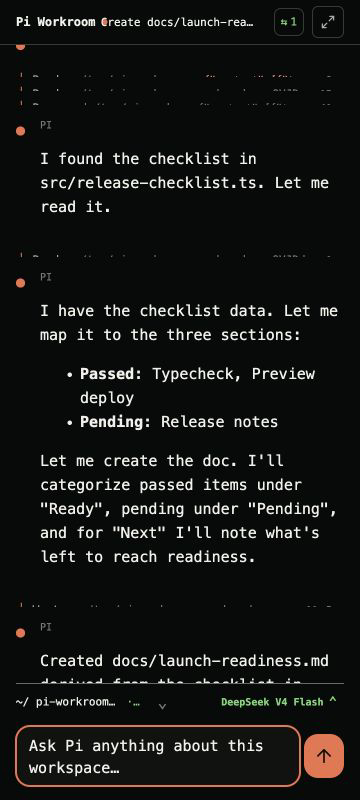
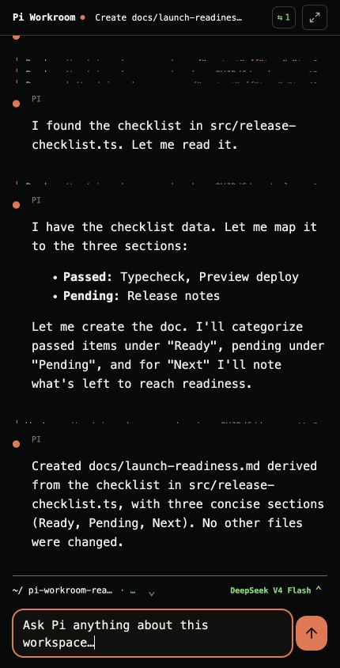
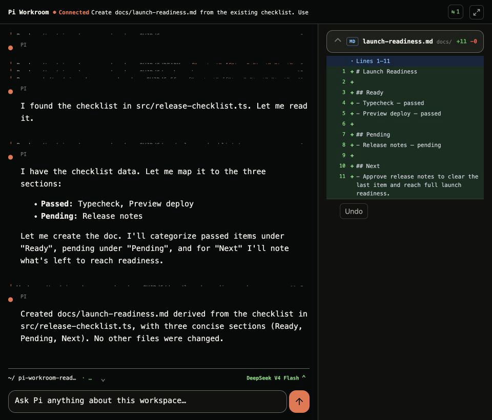

# Pi Workroom

> A local-first workroom for planning, building, reviewing, testing, and continuing work with the [Pi coding agent](https://github.com/earendil-works/pi).

Pi Workroom is a local desktop GUI app for running and resuming Pi sessions, reviewing agent changes, managing MCP tools, searching code locally, and verifying APIs.

[中文 README](README.zh-CN.md) · [Releases](https://github.com/TCcodecode/pi-coding-agent-workroom/releases) · [Report an issue](https://github.com/TCcodecode/pi-coding-agent-workroom/issues) · [Pi coding agent](https://github.com/earendil-works/pi)


## Why Pi Workroom?

Pi is excellent in the terminal. But an AI-assisted project needs a durable operating surface from the first plan through each iteration: project context, sessions, tool calls, file changes, tests, and the next follow-up.

Pi Workroom is built to be that surface: one workroom instead of a chain of disconnected terminals, test clients, project windows, and mobile handoffs. It does not replace Pi or create another agent runtime. Pi remains the source of truth for models, providers, tools, extensions, and session semantics.

## What you can do

| Area | What it gives you |
| --- | --- |
| **Agent workspace** | Multiple projects, sessions, tabs, session trees, plans, todos, and follow-ups |
| **Live review** | A streaming timeline of replies and tool calls, plus unified file diffs |
| **MCP and code search** | Project-aware MCP configuration, Cursor MCP import, local symbol search, and usage lookup |
| **HTTP Workbench** | Repeatable `.http` tests, environments, run history, timing, errors, and sanitized responses |

## Build → review → regression

More projects and more agent output do not remove the review bottleneck; they make it more important. Pi Workroom treats testing as delivery evidence, not as an afterthought.

The goal is not simply to accumulate unit tests or edge cases. It is to preserve repeatable, black-box regression checks that tell you whether an existing workflow still works after an iteration. Today, HTTP Workbench keeps repeatable API checks, environments, and run history beside the project. The product direction is to extend that feedback loop to the end-to-end paths that matter most.

| Review a real change | Keep API checks with the project |
| --- | --- |
|  |  |

### Continue from any screen

The optional, browser-based Companion needs no separate app: on the same Wi-Fi, use your phone's normal keyboard or built-in dictation to send real commands, follow Pi's tool activity, and review file changes. The interface adapts from a narrow foldable cover screen to a regular phone, then opens into a two-pane Chat + Changes workspace on an unfolded foldable.

<p align="center">
  
</p>
<p align="center"><sub>Folded cover → slab phone → unfolded foldable with Chat + Changes</sub></p>

<details>
<summary>See all three responsive layouts</summary>

<p align="center"><strong>Folded cover · one-thumb command and follow-up</strong></p>
<p align="center"></p>

<p align="center"><strong>Slab phone · full conversation and composer</strong></p>
<p align="center"></p>

<p align="center"><strong>Unfolded foldable · Chat and Changes side by side</strong></p>
<p align="center"></p>

</details>

## Product direction

The current Companion is intentionally LAN-only. Do not expose its port to the public internet.

Roadmap items are deliberately separate from the features above:

- **Work away from the desk** — a secure mobile continuation experience for work outside the local network.
- **See what the agent sees** — use a remote-desktop tool when a task needs an existing desktop UI; for web apps, open the running preview directly on the phone when that capability lands.
- **Make regressions visible** — broaden repeatable black-box checks so review can focus on decisions and product quality instead of re-proving every prior workflow manually.

The north star is simple: start focused work at your computer, step out for coffee, and keep creating from a phone without losing the project, its evidence, or the thread of the conversation.

## Install

### Download a release

Download the build for your platform from [GitHub Releases](https://github.com/TCcodecode/pi-coding-agent-workroom/releases).

| Platform | Available package |
| --- | --- |
| macOS | `.dmg` and `.zip` |
| Windows | NSIS installer and `.zip` |
| Linux | `.AppImage`, `.deb`, and `.tar.gz` |

The current pre-release is titled Pi Workroom, but its package asset names still use the former **PiDesk** name because it was built before the rename. It is the same project; future packages use the Pi Workroom name. macOS packages are not yet Developer ID signed or notarized, so macOS may require opening the app from Finder the first time.

### Run from source

Requires Node.js 22.12.0 or later.

```bash
git clone https://github.com/TCcodecode/pi-coding-agent-workroom.git
cd pi-coding-agent-workroom
npm install
npm run dev
```

If Electron is missing after installation, run:

```bash
npm install --include=dev
npm rebuild electron
npm run dev
```

## First five minutes

1. Open a local project folder.
2. Create a Pi session or resume one you started in the terminal.
3. Configure a model provider through Settings if Pi is not already configured.
4. Send a task and follow its timeline, tool calls, plan, and file changes.
5. Turn recurring API checks into `.http` tests in HTTP Workbench.

Pi Workroom continues to use Pi's sessions, provider setup, skills, extensions, and MCP ecosystem.

## How it fits with Pi

| Pi owns | Pi Workroom owns |
| --- | --- |
| Models, providers, tool loop, extensions, session semantics | Desktop windows, project workspace, visual review, local integrations |
| Pi session files and configuration | Project catalog, HTTP Workbench assets, code-index presentation |

The renderer communicates with the Electron main process through typed IPC. It does not receive unrestricted file system, shell, or Node.js access.

## Local data and security

- Pi session files remain under Pi's own session system.
- Project registration and HTTP Workbench state live in the application's local data directory.
- Code indexes are stored in `<project>/.code-index/` and do not require a cloud indexing service.
- Electron `contextIsolation` and sandboxing reduce renderer privilege, but Pi Workroom is not an operating-system security sandbox. Use a container, virtual machine, or another controlled environment when strong isolation is required.

## Development

```bash
npm test
npm run typecheck
npm run lint
npm run build
```

The project is organized into four product surfaces: `app`, `session`, `workspace`, and `http`. Pi runtime semantics stay in the main-process Pi host; the renderer presents projected state through `window.pi`.

## Contributing and support

Please use [Issues](https://github.com/TCcodecode/pi-coding-agent-workroom/issues) for bug reports and focused feature proposals. Include your platform, Pi Workroom version, reproduction steps, and relevant logs. Remove API keys, cookies, tokens, and private paths before sharing.

## Demo assets

The screenshots above use a deliberately isolated local demo project. The capture and redaction checklist is kept in [docs/readme-assets.md](docs/readme-assets.md).

## License and acknowledgements

No project license has been declared yet. Do not assume redistribution or reuse rights until the maintainer publishes one.

Pi Workroom is built around:

- [Pi Agent Harness](https://github.com/earendil-works/pi)
- [`@earendil-works/pi-coding-agent`](https://www.npmjs.com/package/@earendil-works/pi-coding-agent)
