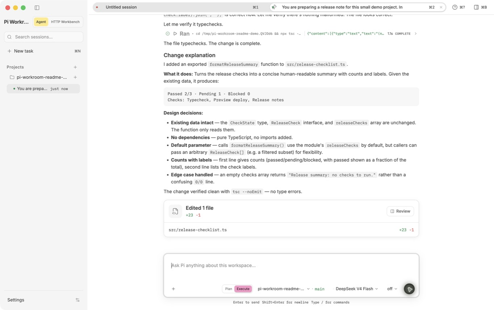
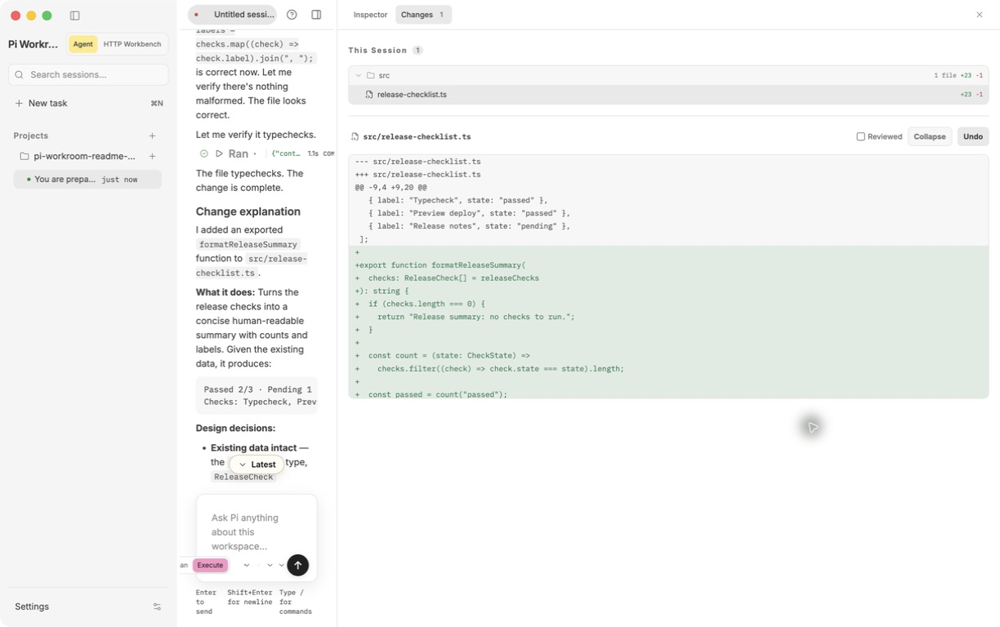
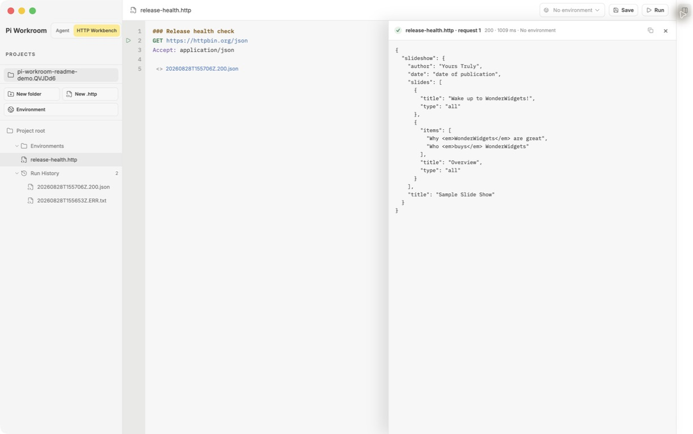
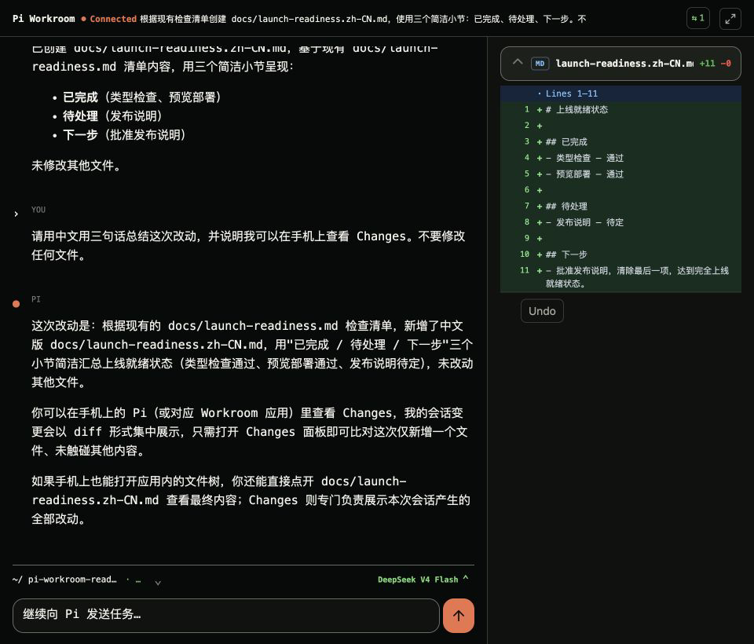
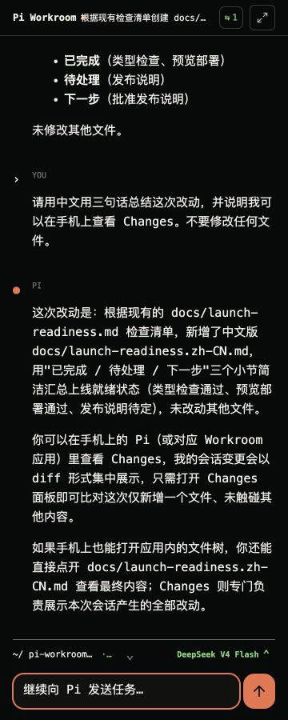
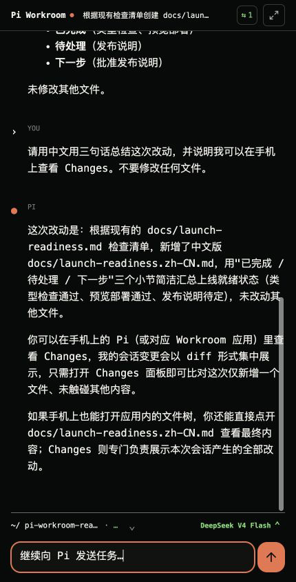

# Pi Workroom

> 围绕 [Pi coding agent](https://github.com/earendil-works/pi) 的本地优先工作台：规划、研发、审阅、测试，以及随时继续工作。

Pi Workroom 是一个本地桌面 GUI 应用，用来运行和恢复 Pi 会话、审阅 Agent 改动、管理 MCP 工具、搜索代码，并验证 API。

[English README](README.md) · [下载 Release](https://github.com/TCcodecode/pi-coding-agent-workroom/releases) · [提交问题或建议](https://github.com/TCcodecode/pi-coding-agent-workroom/issues) · [了解 Pi](https://github.com/earendil-works/pi)



## 为什么需要 Pi Workroom？

Pi 在终端里已经很好用；但一个由 AI 协作推进的项目，从最初的规划到每次迭代，都需要一个稳定的工作界面来承接项目上下文、会话、工具调用、文件改动、测试和下一步 follow-up。

Pi Workroom 想成为这个界面：尽量在一个工作台中完成工作，而不是在终端、测试客户端、项目窗口和手机之间不断切换。它不会替代 Pi，也不会重新实现一个 Agent runtime。Pi 仍然是模型、Provider、工具循环、扩展和会话语义的事实来源。

## 你能用它做什么？

| 区域 | 你会得到什么 |
| --- | --- |
| **Agent 工作区** | 多项目、多会话、多 Tab、会话树、计划、待办与 follow-up |
| **实时审阅** | 流式回复和工具调用时间线，以及统一格式的文件 Diff |
| **MCP 与代码搜索** | 项目级 MCP 配置、Cursor MCP 导入、本地符号搜索和引用查找 |
| **HTTP Workbench** | 可复跑 `.http` 测试、环境、运行历史、耗时、错误和脱敏响应 |

## 构建 → 审阅 → 回归

项目和 Agent 产出变多，并不会消除代码 Review 的瓶颈，反而会让它更关键。Pi Workroom 把测试当作交付证据，而不是最后才补的一步。

重点不只是堆叠单元测试或边界测试，而是保留可以反复运行的黑盒回归：每次迭代后，能够确认既有工作流是否仍然成立。现在，HTTP Workbench 已经把可复跑的 API 检查、环境与运行历史留在项目旁边；产品方向是把这种反馈闭环逐步延伸到最关键的端到端路径。

| 审阅一次真实改动 | 将 API 检查随项目保存 |
| --- | --- |
|  |  |

### 在各种手机形态上继续工作

可选的网页 Companion 不需要另装 App；在同一 Wi-Fi 下，你可以使用手机键盘或系统语音输入发送真实命令、跟进 Pi 的工具活动，并审阅文件改动。界面会从折叠后的窄外屏、普通直板手机，一直适配到展开后的双栏「对话 + Changes」工作区。

<p align="center"></p>
<p align="center"><strong>展开折叠屏</strong><br /><sub>一边保持对话，一边查看文件 Diff。</sub></p>

<table>
  <tr>
    <td align="center">
      <strong>折叠外屏</strong><br />
      <sub>单手发送命令与继续追问</sub><br /><br />
      
    </td>
    <td align="center">
      <strong>直板手机</strong><br />
      <sub>完整对话与输入区</sub><br /><br />
      
    </td>
  </tr>
</table>

## 产品方向

当前 Companion 有意只在局域网内使用；请不要把端口暴露到公网。

下面是与现有功能分开的 Roadmap：

- **离开电脑也能继续工作**：提供安全的移动继续工作体验，覆盖局域网之外的场景。
- **让你看到 Agent 所在的界面**：需要操作既有桌面 UI 时，可配合远程桌面工具；对于网页 App，后续可以直接在手机上打开运行中的预览。
- **让回归更可见**：扩大可复跑的黑盒检查，让 Review 回到决策和产品质量，而不是每次都手工重新证明旧流程没有坏。

北极星很简单：在电脑前开始专注工作，下楼喝杯咖啡时，也能拿起手机继续创作，不丢失项目、证据和上下文。

## 安装

### 下载 Release

从 [GitHub Releases](https://github.com/TCcodecode/pi-coding-agent-workroom/releases) 下载对应平台的安装包。

| 平台 | 提供的安装包 |
| --- | --- |
| macOS | `.dmg` 与 `.zip` |
| Windows | NSIS 安装包与 `.zip` |
| Linux | `.AppImage`、`.deb` 与 `.tar.gz` |

当前预览版的标题已更新为 Pi Workroom，但安装包文件名仍带旧名称 **PiDesk**，因为它在改名前构建。它就是同一个项目；后续安装包会使用 Pi Workroom。macOS 安装包暂未完成 Developer ID 签名和公证，首次启动时可能需要在 Finder 中右键选择“打开”。

### 从源码运行

需要 Node.js 22.12.0 或更高版本。

```bash
git clone https://github.com/TCcodecode/pi-coding-agent-workroom.git
cd pi-coding-agent-workroom
npm install
npm run dev
```

如果安装后缺少 Electron，请运行：

```bash
npm install --include=dev
npm rebuild electron
npm run dev
```

## 前五分钟

1. 打开一个本地项目目录。
2. 新建 Pi 会话，或恢复你此前在终端中使用的会话。
3. 如果尚未完成 Pi 配置，在设置中登录或配置模型 Provider。
4. 发送任务，在时间线中审阅工具调用、计划和文件改动。
5. 将反复使用的 API 检查沉淀成 HTTP Workbench 里的 `.http` 测试。

Pi Workroom 会继续使用 Pi 已有的会话、Provider 配置、skills、extensions 和 MCP 生态。

## Pi 与 Pi Workroom 的边界

| Pi 负责 | Pi Workroom 负责 |
| --- | --- |
| 模型、Provider、工具循环、扩展、会话语义 | 桌面窗口、项目工作区、可视化审阅和本地集成 |
| Pi 的会话文件与配置 | 项目注册表、HTTP Workbench 资产、代码索引展示 |

Renderer 通过类型化 IPC 与 Electron main process 通信，不会获得不受限制的文件系统、Shell 或 Node.js 权限。

## 本地数据与安全边界

- Pi 会话继续由 Pi 的会话系统保存。
- 项目注册与 HTTP Workbench 状态保存在应用的本地数据目录。
- 代码索引保存在 `<project>/.code-index/`，不依赖云端索引服务。
- Electron 的 `contextIsolation` 与 sandbox 会缩小 Renderer 权限，但 Pi Workroom 不是操作系统级安全沙箱。若任务需要强隔离，请使用容器、虚拟机或其他受控环境。

## 开发

```bash
npm test
npm run typecheck
npm run lint
npm run build
```

项目按四个产品领域组织：`app`、`session`、`workspace` 和 `http`。Pi runtime 语义保留在 main process 的 Pi host 中；Renderer 仅通过 `window.pi` 呈现投影后的状态。

## 参与和支持

请通过 [Issues](https://github.com/TCcodecode/pi-coding-agent-workroom/issues) 提交 Bug 和聚焦的功能建议。请附上平台、Pi Workroom 版本、复现步骤和相关日志；分享前务必移除 API key、Cookie、令牌和私有路径。

## 演示素材

上方截图来自一个刻意隔离的本地演示项目。截图拍摄与脱敏清单保存在 [docs/readme-assets.md](docs/readme-assets.md)。

## 许可与致谢

本项目当前尚未声明许可证。在维护者发布许可证前，请不要假定可以再分发或复用代码。

Pi Workroom 建立在下列项目之上：

- [Pi Agent Harness](https://github.com/earendil-works/pi)
- [`@earendil-works/pi-coding-agent`](https://www.npmjs.com/package/@earendil-works/pi-coding-agent)
